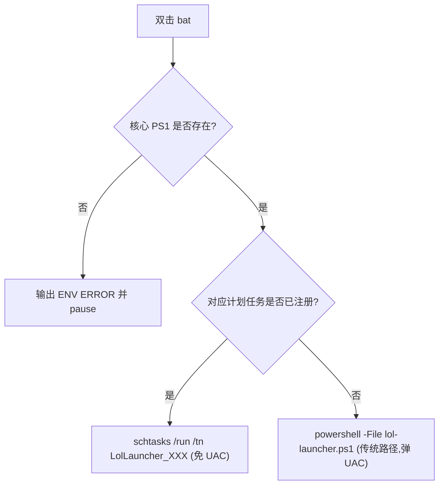
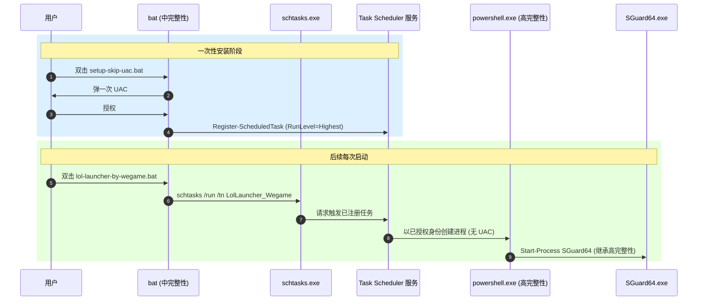

# 免 UAC 启动改造

> [!note]
> **Ref:**
> - 原始项目：[iWonder-byte/lol.launcher.iWonder](https://github.com/iWonder-byte/lol.launcher.iWonder) v1.2.0
> - MITRE ATT&CK T1548.002（明确**不采用**的绕过技术，仅作边界说明）

## 一、背景与动机

原启动器双击运行时，PS1 内部通过 `Start-Process` 调起 `SGuard64.exe`（腾讯反作弊驱动）以及 `WeGameLauncher\launcher.exe` 等子进程，这些进程在 Windows 安全模型下需要 **High** 完整性级别才能加载，因此每次启动都会触发一次 UAC 弹窗。

本次改动的目标：**在不违反 Windows 安全模型、不使用任何 UAC bypass 技术的前提下，把"每次启动弹窗"降为"一次性配置 + 后续静默"**。

## 二、安全审查（原始 v1.2.0）

| 项 | 评级 | 说明 |
|----|------|------|
| `lol-launcher-by-*.bat` 中 `-ExecutionPolicy Bypass` | 🟡 可接受 | 仅本次会话有效，未修改系统策略 |
| `"%~dp0core\lol-launcher.ps1"` 路径解析 | 🟢 安全 | 用脚本所在目录，避免相对路径劫持 |
| `%ERRORLEVEL% NEQ 0` 误报逻辑 | 🔴 缺陷 | PS1 因任何原因非零退出都会被报成"找不到核心文件"，误导用户 |
| `lol-launcher.ps1` 中 `Read-Host` 路径直接写入 `config.json` 并被 `Start-Process` 启动 | ⚠️ 风险 | 本地特权升级链：他人若能写 `config.json`，可让启动器代为执行任意 EXE |
| `Start-Process -FilePath $ACE_PATH` 启动 SGuard64 | ℹ️ 触发 UAC | 这是反作弊驱动本身的提权要求，不是启动器的问题 |
| `iex` / `Invoke-Expression` / 网络下载执行 | 🟢 无 | 整体可控 |

## 三、本次改动清单

### 3.1 已修改：3 个启动器 bat

`lol-launcher-by-{wegame,akari,origin}.bat`



**关键改动**：

1. **修复 ERRORLEVEL 误报**：把"核心文件存在性"校验单独提前到 `if not exist`，避免把 PS1 业务退出码当成"文件缺失"。
2. **引入双路径**：优先 `schtasks /run`，失败时回落到原有 `powershell -File` 调用 —— 即便用户没装计划任务，bat 仍然能用。
3. **任务名约定**：`LolLauncher_Wegame` / `LolLauncher_Akari` / `LolLauncher_Origin`。

### 3.2 新增：`core/setup-scheduled-tasks.ps1`

一次性安装器。功能：

1. 注册上述 3 个计划任务，参数：
   - `RunLevel = Highest`（高完整性级别，免 UAC 的关键）
   - `LogonType = Interactive`（保留窗口可见，PS1 内有 `Read-Host` 引导）
   - `WorkingDirectory = $ProjectRoot`（防止 `$PSScriptRoot\..\config.json` 在某些上下文解析失败）
   - `UserId = $env:USERDOMAIN\$env:USERNAME`（以原始用户身份运行，而非管理员令牌）
2. 加固 `config.json` ACL：
   - `icacls /inheritance:r`（切断目录继承）
   - 仅授予 `当前用户 / SYSTEM / Administrators` 完全控制
   - 解决 §二 中表格里标 ⚠️ 的"他人可写 → 任意 EXE 启动"链

需以管理员身份运行。

### 3.3 新增：`core/uninstall-scheduled-tasks.ps1`

对称的卸载器。功能：

1. 移除上述 3 个计划任务（不存在则跳过）
2. `icacls /reset` + `/inheritance:e` 恢复 `config.json` ACL 继承
3. 启动器 bat 因为有 fallback 逻辑，**无需修改**即可自动回落到传统路径

### 3.4 新增：`setup-skip-uac.bat` / `uninstall-skip-uac.bat`

用户友好入口，通过 `Start-Process -Verb RunAs` 自动唤起 UAC 提升后再执行对应 PS1。

## 四、为什么 Task Scheduler 能做到"免 UAC"

> 注意：这是 Microsoft 文档化支持的合法机制，**不是**绕过 UAC。



**核心原理**：计划任务注册时已经获得用户授权（一次 UAC），之后 Task Scheduler 服务有权直接以授权身份创建高完整性进程，**不再需要二次确认**。

## 五、明确不采用的技术（安全边界）

| 技术 | 类别 | 为何不采用 |
|------|------|------------|
| `fodhelper.exe` / `computerdefaults.exe` / `sdclt.exe` 注册表劫持 | MITRE T1548.002 | 这是恶意软件 UAC bypass 技术，Defender/EDR 会告警 |
| 调低系统 UAC 通知级别 | 系统设置 | 全局降低防护，影响所有程序，**强烈不推荐** |
| 将 SGuard64 加入 AutoElevate 白名单 | —— | Windows 不允许第三方程序加入此白名单，宣称能做到的均为 bypass 技术 |

## 六、用户操作指引

### 安装（仅一次）

1. 双击项目根目录 `setup-skip-uac.bat`
2. 弹出 UAC 提示，点击"是"
3. 看到 3 行 `[OK] 已注册任务: ...` 即完成
4. 后续双击 `lol-launcher-by-*.bat` 不再弹 UAC

### 卸载

1. 双击项目根目录 `uninstall-skip-uac.bat`
2. 弹出 UAC 提示，点击"是"
3. 计划任务被移除，`config.json` ACL 恢复继承
4. 启动器 bat 自动回落到传统路径（每次启动弹一次 UAC）

## 七、Windows 兼容性约定（踩坑记录）

本次开发在 WSL 下完成，初次落地到 Windows 时遇到两类编码事故，固化为后续约束：

| 文件类型 | 约束 | 原因 |
|----------|------|------|
| `.ps1` | **必须 UTF-8 with BOM** (`EF BB BF`) | Windows PowerShell 5.1 解析无 BOM 脚本时默认走系统 ANSI codepage（中文 Windows 是 CP936），中文字符串会被错误解码，触发 `Missing argument in parameter list` 等解析错误 |
| `.bat` | **正文仅 ASCII，中文输出移交 PS1** | `cmd.exe` 启动时按系统 codepage 解析整个 .bat 文件；脚本内 `chcp 65001` 对**当前正在解析的文件**无效，中文行会被切成乱码命令 |

实操：

- 原始 `core/lol-launcher.ps1` 自带 BOM —— 跟随项目约定。
- 4 个 bat（3 launcher + 2 skip-uac entry）所有用户面输出已英文化；需要中文 banner 时由 PS1 端 `Write-Host` 输出。

## 八、变更文件一览

```
项目根/
├── lol-launcher-by-wegame.bat              [改] 双路径 + 修复 ERRORLEVEL 误报
├── lol-launcher-by-akari.bat               [改] 同上
├── lol-launcher-by-origin.bat              [改] 同上
├── setup-skip-uac.bat                      [新] 安装入口 (UAC)
├── uninstall-skip-uac.bat                  [新] 卸载入口 (UAC)
├── core/
│   ├── setup-scheduled-tasks.ps1           [新] 注册任务 + 加固 ACL
│   └── uninstall-scheduled-tasks.ps1       [新] 移除任务 + 恢复 ACL
└── changelog/yceachan/20260513/
    ├── README.md                           [新] 本说明文档
    └── *.patch                             [新] 生成的 patch 文件
```
